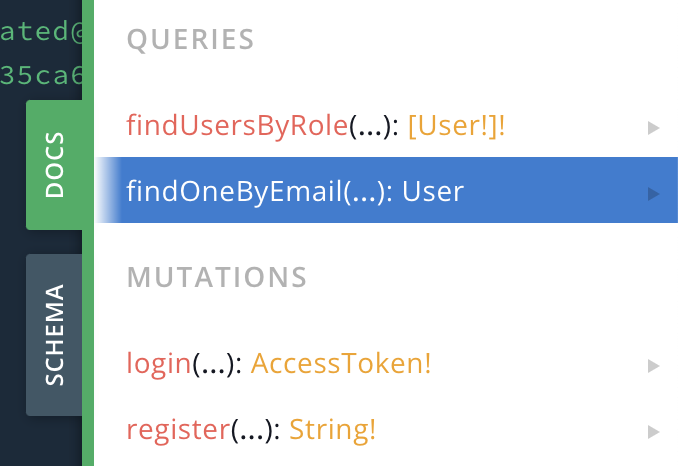
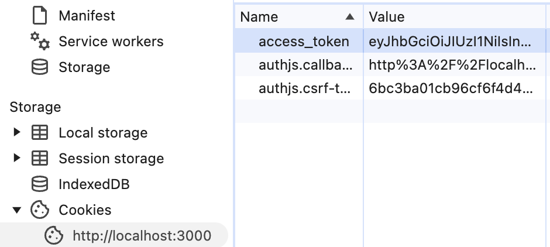

# NestJsAuthService

Small Nest.js microservice proof of concept to handle Authentification&amp;Authorization via GraphQL interface and PostgreSQL db.

# Setup

Prerequisites:

1. Deployed Vercel PosgreSQL db
2. _.env_ populated with variables from this db
   2.1 _.env_ has JWT_SECRET variable, that can be any string
3. `pnpm install`

## Prisma setup

1. `pnpm prisma generate`
2. `pnpm prisma migrate dev --name init`
3. `pnpm prisma migrate deploy`

## How to check that tables and schema were created?

```sh
psql -h your-host -U your-user -d your-database
\dn  # to check schemas
\dt your_schema.*  # to check tables in schema
```

## Running the app

`pnpm start`
go to _http://localhost:3000/graphql._

# Within the app:

Testing will be done inside of [GraphQL playground](https://github.com/graphql/graphql-playground)
There are 4 unauthorized functions:


## First create user/admin:

```sh
mutation {
  register(email: "name@users.com", password: "password", role: ADMIN)
}
```

## Now you will be able to do one of the following queries:

```sh
mutation {
  findUsersByRole(role: ADMIN)
}
```

```sh
mutation {
  findOneByEmail(email: "name@users.com")
}
```

## To check Authorized function, implemented via @nestjs/passport AuthGuard

1. First

```sh
mutation {
  login(email: "name@users.com", password: "password") {
    access_token
  }
}
```

2. You will receive "access_token" which you need to copy
3. Then open f12->Application->Cookies->Create new cookie with name of _access_token_ and value that you copied
   
4. Then in _http://localhost:3000/graphql._ click Settings in top-right corner and change following line like this:
   "request.credentials": "include"
5. This is done, because **GraphQL playground** has broken Cookies setting and is not allowing to attach them easily
6. Try to create new user via admin rights:

```sh
mutation {
  createUser(email: "created@users.com")
}
```

7. Thanks for attention
